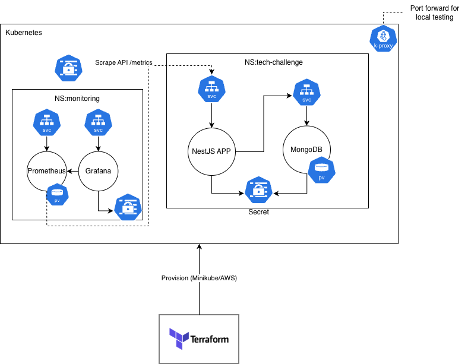
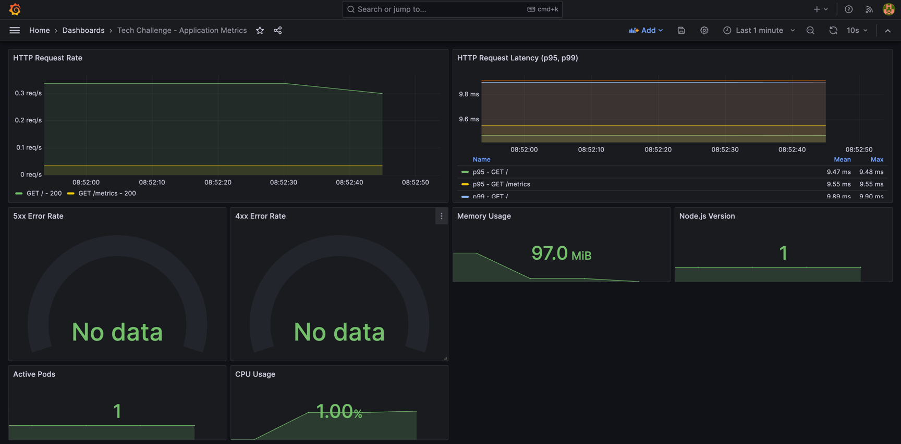

# DevOps Challenge - Implementation Report

## Architecture Overview

The infrastructure is provisioned using Terraform, with a clear separation of concerns:
- **Environment Root Modules**: Located in `terraform/environments/local` and `terraform/environments/aws`, these act as independent Terraform projects, each managing its own state. They define environment-specific configurations (e.g., Minikube cluster connection for local, VPC and EKS cluster for AWS) and call a shared module to deploy the application.
- **Shared `infra-stack` Module**: Located in `terraform/modules/infra-stack`, this module encapsulates the common Kubernetes resource deployments, including the application, MongoDB, Prometheus, and Grafana. It receives environment-specific parameters from the root modules.
- [Jump to deployment guide if you want to use the cluster.
  ](DEPLOYMENT_GUIDE.md)



## Key Design Decisions

### 1. Containerization
**Choice:** Multi-stage Dockerfile with `node:20-alpine`
- **Rationale:** 50% smaller image (~200MB vs 400MB), faster pulls
- **Security:** Non-root user (UID 1001), dropped capabilities, read-only where possible
- **Build optimization:** Layer caching with pnpm for faster rebuilds

### 2. Environment Management Strategy
**Choice:** Separate Terraform root modules per environment with a shared `infra-stack` module.
- **How it works:**
    - `terraform/environments/local` handles Minikube cluster connection and deploys Kubernetes resources using the `infra-stack` module.
    - `terraform/environments/aws` provisions the VPC and EKS cluster, then deploys Kubernetes resources using the `infra-stack` module.
- **Rationale:** This approach provides clear separation of state and configuration for each environment. Common application and monitoring deployments are centralized in the `infra-stack` module, promoting DRY principles and easier maintenance across environments.

### 3. Database Initialization
**Choice:** Init container pattern + ConfigMap
- **K8s:** Init container runs mongo-init.js before app starts
- **Docker Compose:** Volume mount to `/docker-entrypoint-initdb.d/`

### 4. Infrastructure Architecture

#### AWS EKS
- **VPC:** 3 AZs, public + private subnets, NAT Gateway
- **EKS:** Managed control plane, t3.medium nodes (2-4 with autoscaling)
- **Networking:** Private subnets for nodes, NLB in public subnets

#### Local Minikube
- **Resources:** 4GB RAM, 2 CPUs recommended minimum
- **Storage:** Uses default storage class (hostPath)
- **Access:** NodePort services (30080 for app, 30030 for Grafana, 30090 for Prometheus)

### 5. CI/CD Pipeline
**Choice:** GitHub Actions
- **Build Job:** Docker image build + Trivy security scan
- **Test Jobs:** Unit tests, E2E tests, integration test with Docker Compose
- **Push Job:** Docker Hub on main branch (tagged with commit SHA)

### 6. Security Implementation

#### Container Security
- Non-root user (nodejs:1001)
- Minimal Alpine base image
- Capability drop: ALL
- Read-only root filesystem (where applicable)

#### Kubernetes Security
- **Network Policies:** Default deny-all, explicit allow rules
- **RBAC:** Dedicated service accounts with minimal permissions
- **Pod Security:** Baseline enforcement at namespace level
- **Secrets:** Kubernetes secrets (base64), sensitive variables in Terraform

### 7. Monitoring Stack

Taken locally from http://localhost:3000/d/tech-challenge-app/tech-challenge-application-metrics?orgId=1&refresh=10s&from=now-1m&to=now

Required port forward:
```
kubectl port-forward -n monitoring svc/kube-prometheus-stack-grafana 3000:80

# Port forward for running curl request on local app running on minikube 
kubectl port-forward -n tech-challenge svc/tech-challenge-app 30080:80
```



### 8. State Management
**Current:** Local state (terraform.tfstate) for each environment.
**Production recommendation for AWS:**
```hcl
# Uncomment in backend.tf
terraform {
  backend "s3" {
    bucket         = "my-terraform-state"
    key            = "tech-challenge/terraform.tfstate"
    region         = "us-east-1"
    encrypt        = true
    use_lockfile    = "true"
  }
}
```

## Deployment Guide

### Prerequisites
```bash
# Local
docker, docker-compose, minikube, kubectl, terraform >= 1.5

# AWS (additional)
aws-cli configured with credentials
```

### Quick Start - Local
Refer to `terraform/environments/local/README.md` for detailed instructions on deploying to Minikube.

### Quick Start - AWS
Refer to `terraform/environments/aws/README.md` for detailed instructions on deploying to AWS EKS.

### Docker Compose (Development)
```bash
docker compose up -d
# Access: http://localhost:3001
# Metrics: http://localhost:3001/metrics
```

## Testing

### Local Testing
```bash
# Unit tests
docker compose run app npm test

# E2E tests
docker compose run app npm run test:e2e

# Integration test (via CI/CD)
docker compose up -d
curl http://localhost:3001  # Should return visit info

docker compose exec mongodb mongosh -u root --authenticationDatabase admin tech_challenge --eval "db.visits.countDocuments()"
```

### CI/CD Pipeline
Automatically runs on push/PR

## Monitoring Access

### Metrics
- **App metrics:** `http://<app-url>/metrics`
- **Prometheus:** Port 30090 (local) or LoadBalancer (AWS)
- **Grafana:** Port 30030 (local) or LoadBalancer (AWS)

### Dashboards
1. **Application Metrics:** HTTP latency, error rates, request counts, MongoDB ops
2. **MongoDB Metrics:** Connections, operations, memory, network, cache

### Key Metrics
- `http_request_duration_seconds` (p95, p99 latency)
- `http_requests_total` (by status code)

## Trade-offs & Limitations


### Known Limitations
- ⚠️ Local state for Minikube environment (S3 recommended for production AWS)
- ⚠️ Node Port not working locally on macos docker networking (Port forward required)
- ⚠️ No horizontal pod autoscaling (HPA) configured yet

### Production Enhancements
- Add ECR repository for publishing the image on AWS
- Add Github OIDC for github actions
- Add AWS S3 backend for Terraform state in AWS root module
- Add HPA based on CPU/memory metrics
- Deploy NGINX Ingress Controller with cert-manager
- Add AWS WAF for application protection

## Repository Structure
```
.
├── Dockerfile                    # Multi-stage container build
├── docker-compose.yml            # Local development setup
├── .github/workflows/ci-cd.yml   # CI/CD pipeline
├── terraform/                    # Infrastructure as Code
│   ├── environments/             # Terraform Root Modules for each environment
│   │   ├── aws/
│   │   │   ├── main.tf           # AWS environment main configuration
│   │   │   ├── terraform-aws.tfvars # AWS variables
│   │   │   └── outputs.tf        # AWS specific outputs
│   │   └── local/
│   │       ├── main.tf           # Local environment main configuration
│   │       ├── terraform-local.tfvars # Local variables
│   │       ├── tf-local.sh       # Helper script for local deployment
│   │       └── outputs.tf        # Local specific outputs
│   └── modules/                  # Reusable Terraform Modules
│       ├── infra-stack/          # Shared module for K8s resources (App, MongoDB, Monitoring)
│       ├── eks/                  # EKS cluster module
│       ├── k8s-resources/        # Kubernetes app resources module
│       ├── monitoring/           # Prometheus/Grafana module
│       └── networking/           # AWS VPC module
├── monitoring/
│   ├── README.md                 # Monitoring guide
│   └── dashboards/               # Grafana JSON dashboards
├── docs/
│   ├── SECURITY.md               # Security documentation
│   └── TASK8_MONITORING_SUMMARY.md
└── CHALLENGE_REPORT.md           # This document
```
